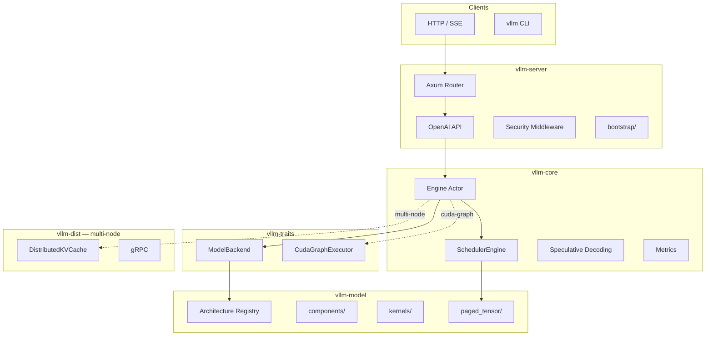
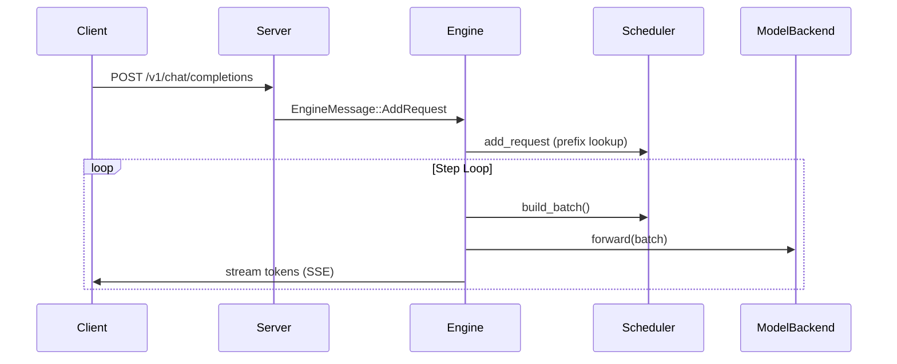
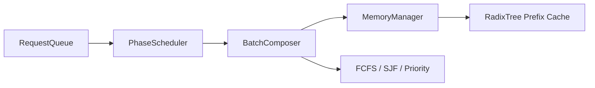

# vLLM-lite Architecture

> Single source of truth for system design. Last updated: v31.0 planning cycle.

## Overview

vLLM-lite is a Rust LLM inference engine implementing vLLM innovations:
**Continuous Batching**, **Paged KV Cache**, **Prefix Caching**, and
**Speculative Decoding**, exposed via an **OpenAI-compatible HTTP API**.

## Crate Responsibilities

| Crate | Role | Key Types |
|-------|------|-----------|
| `vllm-traits` | Zero-dep interfaces | `ModelBackend`, `Batch`, `CudaGraphExecutor` |
| `vllm-core` | Engine + scheduler | `Engine`, `SchedulerEngine`, `RadixTree` |
| `vllm-model` | ML implementations | `CausalLm`, `GqaAttention`, `PagedKvCache` |
| `vllm-server` | HTTP layer | `ApiState`, OpenAI handlers |
| `vllm-dist` | Multi-node (feature-gated) | `DistributedKVCache`, gRPC |
| `vllm-testing` | Test harness | `FakeModel`, `BatchBuilder` |

## Request Lifecycle

The `Engine` uses an **actor pattern**: a dedicated worker thread owns the GPU
model; external callers communicate via `EngineMessage` over mpsc channels.

## Scheduler Internals

**Chunked Prefill**: long prompts are split into memory-bounded chunks.
Continuation chunks use `forward_prefill_continue` (reads existing KV prefix,
writes new tokens at global positions, applies rectangular causal mask).

## KV Cache Layers

| Layer | Location | Responsibility |
|-------|----------|----------------|
| Logical | `core/scheduler/memory/` | Block allocation, LRU eviction |
| Prefix | `core/scheduler/radix_cache/` | O(k) longest-prefix match |
| Physical | `model/paged_tensor/` | Tensor storage, FP8 quant |
| Distributed | `dist/distributed_kv/` | Cross-node hash metadata (multi-node) |

## Feature Flags

| Flag | Crate | Description |
|------|-------|-------------|
| `cuda` | model | Candle CUDA backend |
| `gguf` | model | GGUF weight loading |
| `cuda-graph` | core, server | CUDA Graph capture/replay |
| `multi-node` | core, model, testing | Enable `vllm-dist` |
| `full` | model | `cuda` + `gguf` |

## Architecture Registry

New models are registered in 3 steps:

1. Implement `Architecture` trait in `model/src/<arch>/arch.rs`
2. Add `register.rs` calling `registry.register::<T>()`
3. Wire into `register_all_archs()` in `arch/registry.rs`

Stub architectures (Gemma3, Llama4, Phi4, Mistral Small) share
`StubArchitecture` in `arch/stub.rs`.

## Testing Strategy

| Tier | Command | Scope |
|------|---------|-------|
| Fast | `just nextest` | Unit + integration (skips `#[ignore]`) |
| Checkpoint | `just nextest-checkpoint` | Real weight tests |
| Full | `just nextest-all` | All tests including slow |
| Fuzz | `just fuzz-smoke` | 7 fuzz targets |
| Mutation | `just mutants MODULE` | cargo-mutants (907 mutants, 100%) |

## Related Documents

- [ROADMAP.md](../ROADMAP.md) — feature roadmap
- [CHANGELOG.md](../CHANGELOG.md) — release history (most authoritative)
- [OPERATIONS.md](../OPERATIONS.md) — deployment & troubleshooting
- [docs/adr/](./adr/) — Architecture Decision Records
- [docs/tutorial/](./tutorial/) — onboarding guides
- [AGENTS.md](../AGENTS.md) — development conventions
